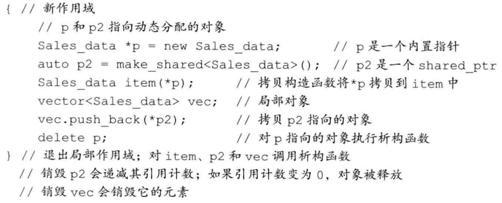

[toc]

# 第13章 拷贝控制

一个类通过定义五种特殊的成员函数来控制对象的拷贝、移动、赋值和销毁操作。

- 拷贝构造函数（copy constructor）

- 拷贝赋值运算符（copy-assignment operator）

- 移动构造函数（move constructor）

- 移动赋值运算符（move-assignment operator）

- 析构函数（destructor）

这些操作统称为拷贝控制操作（copy control）。

在定义任何类时，拷贝控制操作都是必要部分。

## 拷贝、赋值与销毁（Copy，Assign，and Destroy）

### 拷贝构造函数（The Copy Constructor）

如果一个构造函数的第一个参数是==自身类类型的引用==（几乎总是`const`引用），且任何额外参数都有默认值，则此构造函数是拷贝构造函数。

>   拷贝构造函数自己的参数必须是引用类型，否则为了调用拷贝构造函数，我们必须拷贝它的实参，但为了拷贝实参，又需要调用拷贝构造函数，如此会无限循环。

```c++
class Foo
{
public:
    Foo();   // default constructor
    Foo(const Foo&);   // copy constructor
    // ...
};
```

==由于拷贝构造函数在一些情况下会被隐式使用，因此通常不会声明为`explicit`的。==

如果类未定义自己的拷贝构造函数，编译器会为类合成一个。一般情况下，合成拷贝构造函数（synthesized copy constructor）会将其参数的非`static`成员逐个拷贝到正在创建的对象中。

```c++
class Sales_data
{
public:
    // other members and constructors as before
    // declaration equivalent to the synthesized copy constructor
    Sales_data(const Sales_data&);
private:
    std::string bookNo;
    int units_sold = 0;
    double revenue = 0.0;
};

// equivalent to the copy constructor that would be synthesized for Sales_data
Sales_data::Sales_data(const Sales_data &orig):
    bookNo(orig.bookNo),    // uses the string copy constructor
    units_sold(orig.units_sold),    // copies orig.units_sold
    revenue(orig.revenue)   // copies orig.revenue
    { } // empty bod
```

==使用直接初始化时，实际上是要求编译器按照函数匹配规则来选择与实参最匹配的构造函数(也包括拷贝构造函数)。使用拷贝初始化时，是要求编译器将右侧运算对象拷贝到正在创建的对象中，如果需要的话还要进行类型转换。==

```c++
string dots(10, '.');   // direct initialization
string s(dots);         // direct initialization
string s2 = dots;       // copy initialization
string null_book = "9-999-99999-9";    // copy initialization
string nines = string(100, '9');       // copy initialization
```

拷贝初始化通常使用拷贝构造函数来完成。但如果一个类拥有移动构造函数，则拷贝初始化有时会使用移动构造函数而非拷贝构造函数来完成。

==发生拷贝初始化的情况：==

- ==用`=`定义变量。==

- ==将对象作为实参传递给非引用类型的形参。==例如，a = b

- ==从一个返回类型为非引用类型的函数返回对象。==

- ==用花括号列表初始化数组中的元素或聚合类中的成员。==

当传递一个实参或者从函数返回一个值时，不能隐式使用`explicit`构造函数。

>   也就是说，你传递的实参没法隐式的转换为对应含参的构造函数。
>
>   如下代码第二行，谁知道你的10代表的什么意思，是vector的长度呢，还是元素值呢

```c++
vector<int> v1(10);     // ok: direct initialization
vector<int> v2 = 10;    // error: constructor that takes a size is explicit，接受大小参数的构造函数必须是explicit的
void f(vector<int>);    // f's parameter is copy initialized
f(10);      // error: can't use an explicit constructor to copy an argument
f(vector<int>(10));     // ok: directly construct a temporary vector from an int
```

### 拷贝赋值运算符（The Copy-Assignment Operator）

重载运算符（overloaded operator）的参数表示运算符的运算对象。

如果一个运算符是成员函数，则其左侧运算对象会绑定到隐式的`this`参数上。

==赋值运算符通常应该返回一个指向其左侧运算对象的引用==。

```c++
class Foo
{
public:
    Foo& operator=(const Foo&);  // assignment operator
    // ...
};
```

标准库通常要求保存在容器中的类型要具有赋值运算符，且其返回值是左侧运算对象的引用。

==如果类未定义自己的拷贝赋值运算符，编译器会为类合成一个。==一般情况下，合成拷贝赋值运算符（synthesized copy-assignment operator）会将其右侧运算对象的非`static`成员逐个赋值给左侧运算对象的对应成员，之后返回左侧运算对象的引用。

```c++
// equivalent to the synthesized copy-assignment operator
Sales_data& Sales_data::operator=(const Sales_data &rhs)
{
    bookNo = rhs.bookNo;    // calls the string::operator=
    units_sold = rhs.units_sold;    // uses the built-in int assignment
    revenue = rhs.revenue;  // uses the built-in double assignment
    return *this;   // return a reference to this object
}
```

### 析构函数（The Destructor）

==析构函数负责释放对象使用的资源，并销毁对象的非`static`数据成员。==

析构函数的名字由波浪号`~`接类名构成，它没有返回值，也不接受参数。

```c++
class Foo
{
public:
    ~Foo(); // destructor
    // ...
};
```

由于析构函数不接受参数，所以它不能被重载。

如果类未定义自己的析构函数，编译器会为类合成一个。合成析构函数（synthesized destructor）的函数体为空。

析构函数首先执行函数体，然后再销毁数据成员。在整个对象销毁过程中，析构函数体是作为成员销毁步骤之外的另一部分而进行的。成员按照初始化顺序的逆序销毁。

==隐式销毁一个内置指针类型的成员不会`delete`它所指向的对象。==

无论何时一个对象被销毁，都会自动调用其析构函数。

==当指向一个对象的引用或指针离开作用域时，该对象的析构函数不会执行。==（这也就是为什么需要手动释放new出来的空间、引入智能指针的原因）



### 三/五法则（The Rule of Three/Five）

==需要析构函数的类一般也需要拷贝和赋值操作。==原因见 [拷贝控制和资源管理](#拷贝控制和资源管理（Copy Control and Resource Management）)

需要拷贝操作的类一般也需要赋值操作，反之亦然。

### 使用`=default`（Using `=default`）

可以通过将拷贝控制成员定义为`=default`来显式地要求编译器生成合成版本。

```c++
class Sales_data
{
public:
    // copy control; use defaults
    Sales_data() = default;
    Sales_data(const Sales_data&) = default;
    ~Sales_data() = default;
    // other members as before
};
```

在类内使用`=default`修饰成员声明时，合成的函数是隐式内联的。如果不希望合成的是内联函数，应该只对成员的类外定义使用`=default`。

只能对具有合成版本的成员函数使用`=default`。（即，默认构造函数 + 拷贝控制成员（五种函数））

### 阻止拷贝（Preventing Copies）

大多数类应该定义默认构造函数、拷贝构造函数和拷贝赋值运算符，无论是显式地还是隐式地。

在C++11新标准中，将拷贝构造函数和拷贝赋值运算符定义为删除的函数（deleted function）可以阻止类对象的拷贝。==删除的函数是一种虽然进行了声明，但是却不能以任何方式使用的函数。==定义删除函数的方式是在函数的形参列表后面添加`=delete`。

>   例如，iostream 类阻止了拷贝，以避免多个对象写入或读取相同的 IO 缓冲。

```c++
struct NoCopy
{
    NoCopy() = default; // use the synthesized default constructor
    NoCopy(const NoCopy&) = delete; // no copy
    NoCopy &operator=(const NoCopy&) = delete; // no assignment
    ~NoCopy() = default; // use the synthesized destructor
    // other members
};
```

`===delete`和`=default`有两点不同：==

- ==`=delete`可以对任何函数使用；`=default`只能对具有合成版本的函数使用。==

- ==`=delete`必须出现在函数第一次声明的地方；`=default`既能出现在类内，也能出现在类外。==

析构函数不能是删除的函数。对于析构函数被删除的类型，不能定义该类型的变量或者释放指向该类型动态分配对象的指针。

如果一个类中有数据成员不能默认构造、拷贝或销毁，则对应的合成拷贝控制成员将被定义为删除的。

==在旧版本的C++标准中，类通过将拷贝构造函数和拷贝赋值运算符声明为`private`成员来阻止类对象的拷贝。在新标准中建议使用`=delete`而非`private`。==

>   如果是旧版本 private，也是有风险的，可以通过成员函数来调用

## 拷贝控制和资源管理（Copy Control and Resource Management）

通常，管理类外资源的类必须定义拷贝控制成员。

>   解释了为什么需要析构函数的类一般也需要拷贝和赋值操作。
>
>   类的行为像一个值，意味着它应该也有自己的状态。当我们拷贝一个像值得对象时，副本和原对象是完全独立的。改变副本不会对原对象有任何影响，反之亦然。
>
>   行为像指针得类则共享状态。当我们拷贝一个这种类得对象时，副本和原对象使用相同的底层数据。改变副本也会改变原对象，反之亦然。
>
>   标准库容器和 string 类的行为像一个值，`shared_ptr` 类提供类似指针的行为

### 行为像值的类（Classes That Act Like Values）

>   定义一个拷贝构造函数，完成 string 的拷贝，而不是拷贝指针
>
>   定义一个析构函数来释放 string
>
>   定义一个拷贝赋值运算符来释放当前对象的 string，并从右侧运算对象拷贝 string

```C++
class HasPtr
{
public:
    HasPtr(const std::string &s = std::string()):
        ps(new std::string(s)), i(0) { }
    // each HasPtr has its own copy of the string to which ps points
    HasPtr(const HasPtr &p):
        ps(new std::string(*p.ps)), i(p.i) { }
    HasPtr& operator=(const HasPtr &);
    ~HasPtr() { delete ps; }

private:
    std::string *ps;
    int i;
};
```

编写赋值运算符时有两点需要注意：

- 即使将一个对象赋予它自身，赋值运算符也能正确工作。以下是错误版本，顺序很重要！

  ```c++
  // WRONG way to write an assignment operator!
  HasPtr& HasPtr::operator=(const HasPtr &rhs)
  {
      delete ps;   // frees the string to which this object points
      // if rhs and *this are the same object, we're copying from deleted memory!
      ps = new string(*(rhs.ps));
      i = rhs.i;
      return *this;
  }
  ```

- 赋值运算符通常结合了拷贝构造函数和析构函数的工作。以下是正确版本，执行顺序很重要！

  编写赋值运算符时，==一个好的方法是先将右侧运算对象拷贝到一个局部临时对象中。拷贝完成后，就可以安全地销毁左侧运算对象的现有成员了。==

  ```c++
  HasPtr& HasPtr::operator=(const HasPtr &rhs)
  {
      auto newp = new string(*rhs.ps);    // copy the underlying string，临时对象
      delete ps;   // free the old memory
      ps = newp;   // copy data from rhs into this object
      i = rhs.i;
      return *this;   // return this object
  }
  ```

### 定义行为像指针的类（Defining Classes That Act Like Pointers）

```c++
class HasPtr
{
public:
    // constructor allocates a new string and a new counter, which it sets to 1
    // 构造函数分配新的string 和新的计数器，将计数器置1
    HasPtr(const std::string &s = std::string()):
        ps(new std::string(s)), i(0), use(new std::size_t(1)) {}
    // copy constructor copies all three data members and increments the counter
    HasPtr(const HasPtr &p):
        ps(p.ps), i(p.i), use(p.use) { ++*use; }
    HasPtr& operator=(const HasPtr&);
    ~HasPtr();

private:
    std::string *ps;
    int i;
    std::size_t *use; // member to keep track of how many objects share *ps，用use指针来指向一块保存引用计数的内存区域
};
```

析构函数释放内存前应该判断是否还有其他对象指向这块内存。

```c++
// 析构时需要判断是否还有其他对象指向这块内存
HasPtr::~HasPtr()
{
    if (--*use == 0)
    {   // if the reference count goes to 0
        delete ps;   // delete the string
        delete use;  // and the counter
    }
}
// 赋值时，需要对等号左边的对象引用计数--，对等号右边的对象引用计数++
HasPtr& HasPtr::operator=(const HasPtr &rhs)
{
    ++*rhs.use;    // increment the use count of the right-hand operand
    if (--*use == 0)
    {   // then decrement this object's counter
        delete ps; // if no other users
        delete use; // free this object's allocated members
    }
    ps = rhs.ps;    // copy data from rhs into this object
    i = rhs.i;
    use = rhs.use;
    return *this;   // return this object
}
```

## 交换操作（Swap）

通常，管理类外资源的类会定义`swap`函数。如果一个类定义了自己的`swap`函数，算法将使用自定义版本，否则将使用标准库定义的`swap`。

>   将swap 声明为友元，然后再类外定义，调用标准库的 swap，交换指针和值即可。

```c++
class HasPtr
{
    friend void swap(HasPtr&, HasPtr&);
    // other members as in § 13.2.1 (p. 511)
};

inline void swap(HasPtr &lhs, HasPtr &rhs)
{
    using std::swap;
    swap(lhs.ps, rhs.ps);   // swap the pointers, not the string data
    swap(lhs.i, rhs.i);     // swap the int members
}
```

一些算法在交换两个元素时会调用`swap`函数，其中每个`swap`调用都应该是未加限定的。如果存在类型特定的`swap`版本，其匹配程度会优于`std`中定义的版本（假定作用域中有`using`声明）。

>   第一种直接调用标准库的 swap 函数，能正常运行，但是效率太低
>
>   第二种声明了标准库 swap 函数，然后再调用 swap，如果存在类型特定的 swap 版本，那么会优先匹配

```c++
void swap(Foo &lhs, Foo &rhs)
{
    // WRONG: this function uses the library version of swap, not the HasPtr version
    std::swap(lhs.h, rhs.h);
    // swap other members of type Foo
}

void swap(Foo &lhs, Foo &rhs)
{
    using std::swap;
    swap(lhs.h, rhs.h);  // uses the HasPtr version of swap
    // swap other members of type Foo
}
```

与拷贝控制成员不同，`swap`函数并不是必要的。但是对于分配了资源的类，定义`swap`可能是一种重要的优化手段。

由于`swap`函数的存在就是为了优化代码，所以一般将其声明为内联函数。

定义了`swap`的类通常用`swap`来实现赋值运算符。在这种版本的赋值运算符中，右侧运算对象以值方式传递，然后将左侧运算对象与右侧运算对象的副本进行交换（拷贝并交换，copy and swap）。这种方式可以正确处理自赋值情况。

>   赋值其实就是单向的 swap，右侧对象为什么要以值方式传递呢：因为这样就可以不改变右侧对象的内容了

```c++
// note rhs is passed by value, which means the HasPtr copy constructor
// copies the string in the right-hand operand into rhs
HasPtr& HasPtr::operator=(HasPtr rhs)
{
    // swap the contents of the left-hand operand with the local variable rhs
    swap(*this, rhs);   // rhs now points to the memory this object had used
    return *this;       // rhs is destroyed, which deletes the pointer in rhs
}
```

## 拷贝控制示例（A Copy-Control Example）

拷贝赋值运算符通常结合了拷贝构造函数和析构函数的工作。在这种情况下，公共部分应该放在`private`的工具函数中完成。

## 动态内存管理类（Classes That Manage Dynamic Memory）

移动构造函数通常是将资源从给定对象“移动”而不是拷贝到正在创建的对象中。

## 对象移动（Moving Objects）

某些情况下，一个对象拷贝后就立即被销毁了，此时移动而非拷贝对象会大幅度提高性能。

在旧版本的标准库中，容器所能保存的类型必须是可拷贝的。但在新标准中，可以用容器保存不可拷贝，但可移动的类型。

标准库容器、`string`和`shared_ptr`类既支持移动也支持拷贝。(以 vector 为例，在重新分配内存的过程中，从旧内存将元素拷贝到新内存是不必要的，更好的方式是移动元素)。IO类和`unique_ptr`类可以移动但不能拷贝。

### 右值引用（`Rvalue` Reference）

为了支持移动操作，C++11引入了右值引用类型。右值引用就是必须绑定到右值的引用。可以通过`&&`来获得右值引用。

>   不能将一个右值引用绑定到一个左值上
>
>   不能将左值引用绑定到右值上
>
>   可以用 `const` 引用绑定右值

```c++
int i = 42;
int &r = i;         // ok: r refers to i
int &&rr = i;       // error: cannot bind an rvalue reference to an，不能将一个右值引用绑定到一个左值上
int &r2 = i * 42;   // error: i * 42 is an rvalue，不能将左值引用绑定到右值上
const int &r3 = i * 42;    // ok: we can bind a reference to const to an rvalue，可以用const引用绑定右值
int &&rr2 = i * 42;        // ok: bind rr2 to the result of the multiplication，乘法结果是一个右值
```

==右值引用只能绑定到即将被销毁，并且没有其他用户的临时对象上。==使用右值引用的代码可以自由地接管所引用对象的资源。

==变量表达式都是左值，所以不能将一个右值引用直接绑定到一个变量上，即使这个变量的类型是右值引用也不行。==

```c++
int &&rr1 = 42;     // ok: literals are rvalues
int &&rr2 = rr1;    // error: the expression rr1 is an lvalue!
```

调用`move`函数可以获得绑定在左值上的右值引用，此函数定义在头文件`utility`中。

```c++
int &&rr3 = std::move(rr1);  // move告诉编译器，我们有一个左值，但希望像一个右值一样处理它
```

调用`move`函数的代码应该使用`std::move`而非`move`，这样做可以避免潜在的名字冲突。

==Note==

>   左值持久：对象的身份，右值短暂：对象的值

### 移动构造函数和移动赋值运算符（Move Constructor and Move Assignment）

==移动构造函数的第一个参数是该类类型的右值引用，其他任何额外参数都必须有默认值。==

除了完成资源移动，移动构造函数还必须确保移后源对象是可以安全销毁的。

在函数的形参列表后面添加关键字`noexcept`可以指明该函数不会抛出任何异常。（对于拷贝构造函数而言，如果拷贝过程中出现异常，可以恢复原状，然后抛出异常；但对于移动构造函数而言，无法恢复原状，故告诉编译器无需抛出异常，后果自负）

对于移动构造函数，`noexcept`位于形参列表和初始化列表开头的冒号之间。在类的头文件声明和定义中（如果定义在类外）都应该指定`noexcept`。

>   下面代码解释：
>
>   与构造函数不同，移动构造函数不分配任何新内存；它接管给定的`StrVec`中的内存。在接管内存之后，将给定对象中的指针都置为`nullptr`。

```c++
class StrVec
{
public:
    // 移动操作不应抛出任何异常
    StrVec(StrVec&&) noexcept: elements(s.elements), first_free(s.first_free), cap(c.cap){
        // 令 s 进入这样的状态，对其运行析构函数是安全的
        s.elements = s.first_free = s.cap = nullptr;
    }

};
```

标准库容器能对异常发生时其自身的行为提供保障。虽然移动操作通常不抛出异常，但抛出异常也是允许的。为了安全起见，除非容器确定元素类型的移动操作不会抛出异常，否则在重新分配内存的过程中，它就必须使用拷贝而非移动操作。

==不抛出异常的移动构造函数和移动赋值运算符必须标记为`noexcept`。==

在移动操作之后，源对象必须保持有效的、可销毁的状态，但是用户不能使用它的值。

```c++
StrVec &StrVec::operator=(StrVec &&rhs) noexcept
{
    // direct test for self-assignment，检测自我赋值
    if (this != &rhs)
    {
        free();     // 释放已有元素
        elements = rhs.elements;    // 从rhs接管资源
        first_free = rhs.first_free;
        cap = rhs.cap;
        // 将rhs置于可析构状态
        rhs.elements = rhs.first_free = rhs.cap = nullptr;
    }
    return *this;
}
```

==只有当一个类没有定义任何拷贝控制成员，且类的每个非`static`数据成员都可以移动时，编译器才会为类合成移动构造函数和移动赋值运算符。==编译器可以移动内置类型的成员。如果一个成员是类类型，且该类有对应的移动操作，则编译器也能移动该成员。

```c++
// the compiler will synthesize the move operations for X and hasX
struct X
{
    int i;   // built-in types can be moved
    std::string s;   // string defines its own move operations
};

struct hasX
{
    X mem; // X has synthesized move operations
};

X x, x2 = std::move(x);         // uses the synthesized move constructor
hasX hx, hx2 = std::move(hx);   // uses the synthesized move constructor
```

与拷贝操作不同，移动操作永远不会被隐式定义为删除的函数。但如果显式地要求编译器生成`=default`的移动操作，且编译器不能移动全部成员，则移动操作会被定义为删除的函数。

==定义了移动构造函数或移动赋值运算符的类必须也定义自己的拷贝操作，否则这些成员会被默认地定义为删除的函数。==

如果一个类有可用的拷贝构造函数而没有移动构造函数，则其对象是通过拷贝构造函数来“移动”的，即使调用`move`函数时也是如此。拷贝赋值运算符和移动赋值运算符的情况类似。

```c++
class Foo
{
public:
    Foo() = default;
    Foo(const Foo&);    // copy constructor
    // other members, but Foo does not define a move constructor
};

Foo x;
Foo y(x);   // copy constructor; x is an lvalue
Foo z(std::move(x));    // copy constructor, because there is no move constructor
```

使用非引用参数的单一赋值运算符可以实现拷贝赋值和移动赋值两种功能。依赖于实参的类型，==左值被拷贝，右值被移动。==

```c++
// assignment operator is both the move- and copy-assignment operator
HasPtr& operator=(HasPtr rhs)
{
    swap(*this, rhs);
    return *this;
}

hp = hp2;   // hp2 is an lvalue; copy constructor used to copy hp2
hp = std::move(hp2);    // move constructor moves hp2
```

建议将五个拷贝控制成员当成一个整体来对待。如果一个类需要任何一个拷贝操作，它就应该定义所有五个操作。

==移动赋值运算符可以直接检查自赋值情况。==

C++11标准库定义了移动迭代器（move iterator）适配器。一个移动迭代器通过改变给定迭代器的解引用运算符的行为来适配此迭代器。移动迭代器的解引用运算符返回一个右值引用。

调用`make_move_iterator`函数能将一个普通迭代器转换成移动迭代器。原迭代器的所有其他操作在移动迭代器中都照常工作。

最好不要在移动构造函数和移动赋值运算符这些类实现代码之外的地方随意使用`move`操作。

### 右值引用和成员函数（`Rvalue` References and Member Functions）

区分移动和拷贝的重载函数通常有一个版本接受一个`const T&`参数，另一个版本接受一个`T&&`参数（`T`为类型）。

```c++
void push_back(const X&);   // copy: binds to any kind of X
void push_back(X&&);        // move: binds only to modifiable rvalues of type X
```

==有时可以对右值赋值：==

```c++
string s1, s2;
s1 + s2 = "wow!";
```

在旧标准中，没有办法阻止这种使用方式。为了维持向下兼容性，新标准库仍然允许向右值赋值。但是可以在自己的类中阻止这种行为，规定左侧运算对象（即`this`指向的对象）必须是一个左值。

在非`static`成员函数的形参列表后面添加引用限定符（reference qualifier）可以指定`this`的左值/右值属性。（==解决了对右值进行赋值的问题==）

引用限定符可以是`&`或者`&&`，分别表示`this`可以指向一个左值或右值对象。引用限定符必须同时出现在函数的声明和定义中。

```c++
class Foo
{
public:
    Foo &operator=(const Foo&) &; // 只能向可修改的左值赋值
    // other members of Foo
};

Foo &Foo::operator=(const Foo &rhs) &
{
    return *this;
}
Foo &retFoo();		// 返回一个引用；retFoo调用是一个左值
Foo retVal();		// 返回一个值，retVal调用是一个右值
Foo i, j;			// i和j是左值
i = j;				// 正确，i是左值
retFoo() = j;		// 正确，retFoo()返回一个左值
retVal() = j;		// 错误，retVal()返回一个右值
i = retVal(); 		// 正确
```

一个非`static`成员函数可以同时使用`const`和引用限定符，此时引用限定符跟在`const`限定符之后。

```c++
class Foo
{
public:
    Foo someMem() & const;      // error: const qualifier must come first
    Foo anotherMem() const &;   // ok: const qualifier comes first
};
```

引用限定符也可以区分成员函数的重载版本。

```c++
class Foo
{
public:
    Foo sorted() &&;        // 可用于可改变的右值
    Foo sorted() const &;   // 可用于任何类型的Foo
};

retVal().sorted();   // retVal() 是一个右值，调用 Foo::sorted() &&
retFoo().sorted();   // retFoo() 是一个左值，调用 Foo::sorted() const &
```

如果一个成员函数有引用限定符，则具有相同参数列表的所有重载版本都必须有引用限定符。

```c++
class Foo
{
public:
    Foo sorted() &&;
    Foo sorted() const;    // 错误，必须加上引用限定符
    // Comp is type alias for the function type
    // that can be used to compare int values
    using Comp = bool(const int&, const int&);	// 正确，不同的参数列表
    Foo sorted(Comp*);  // 正确，两个版本都没有引用限定符
};
```